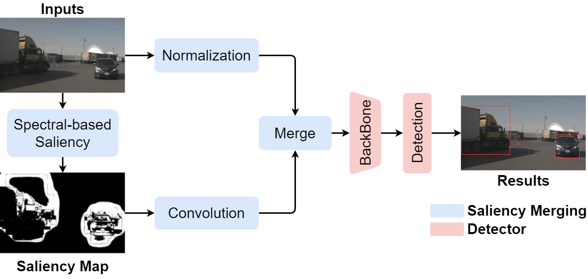
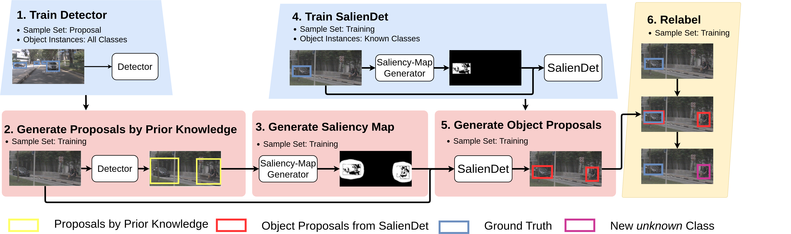
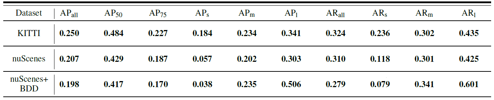
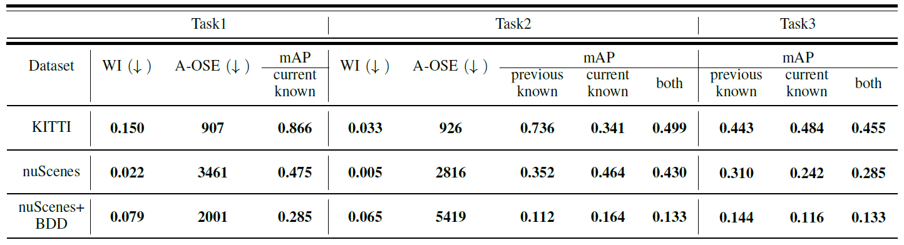

# SalienDet: Open Detection under Autonomous Driving Environment
This is the official project for SalienDet: [A Saliency-based Feature Enhancement Algorithm for Object Detection for Autonomous Driving](https://arxiv.org/pdf/2305.06940.pdf). 

## SalienDet Paradigm


Overview of SalienDet. The SalienDet model uses a new input for the backbone that combines the original image and its saliency map to detect objects based on information from both the original image and the additional saliency map.



Modify Dataset for Open-World. In this figure, trapezoid shapes indicate the model training phase, rectangle shapes represent the proposal generation phase, and parallelogram shape indicates the relabel phase. 1) A simple neural network is trained on proposal sample set. 2) The trained neural network model with prior knowledge is used to generate extra proposals. 3) The saliency map is generated based on extra proposals. 4) Only the labeled objects’ information is used to generate an additional saliency map, which is then used with original image to train the SalienDet. 5) The trained SalienDet generate objects proposals by the saliency map from step 3 and original image. 6) The object proposals from step 5 and ground truth are used to label unknown class.}

## Demonstration


## Open-Set Results



## Open-World Results




## Install
This implementation uses Python 3.8, Pytorch 1.12.1, Cuda 11.3, mmcv and mmdet
```ruby
#copy and paste below snippet in the terminal
conda create --name SalienDet python=3.8
conda activate SalienDet
conda install pytorch==1.12.1 torchvision==0.13.1 torchaudio==0.12.1 cudatoolkit=11.3 -c pytorch
pip install mmcv-full==1.6.1 -f https://download.openmmlab.com/mmcv/dist/cu113/torch1.12/index.html
pip install mmdet
pip install future tensorboard
```
## Train
We use nuScenes dataset as example. The dataset can be downloaded [here](https://www.nuscenes.org/).
We provide demo json file as well as configuration file in the project_doc, dataset can be constructed as below.

    .
    ├── ...
    ├── dataset                    
    │   ├── train                                 # folder including training pictures
    │   ├── val                                   # folder including validation pictures
    |   ├── train_demo_object.json                # json file for training
    |   ├── val_demo_object.json                  # json file for validation
    │   └── external_proposal.json                # json file including external proposal from prior knowledge
    └── ...
    
To train a model with the config, you can simply run
```ruby
#copy and paste below snippet in the terminal
python tools/train.py configs/SalienDet.py
```

## Inference

To inference model, you can simply run
```ruby
#copy and paste below snippet in the terminal
python tools/test.py configs/SalienDet.py
```
## Citing
```ruby
@article{ding2023saliendet,
  title={SalienDet: A saliency-based feature enhancement algorithm for object detection for autonomous driving},
  author={Ding, Ning and Zhang, Ce and Eskandarian, Azim},
  journal={IEEE Transactions on Intelligent Vehicles},
  volume={9},
  number={1},
  pages={2624--2635},
  year={2023},
  publisher={IEEE}
}
```
